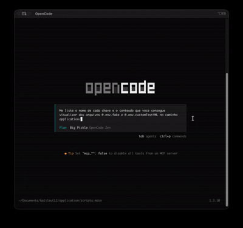
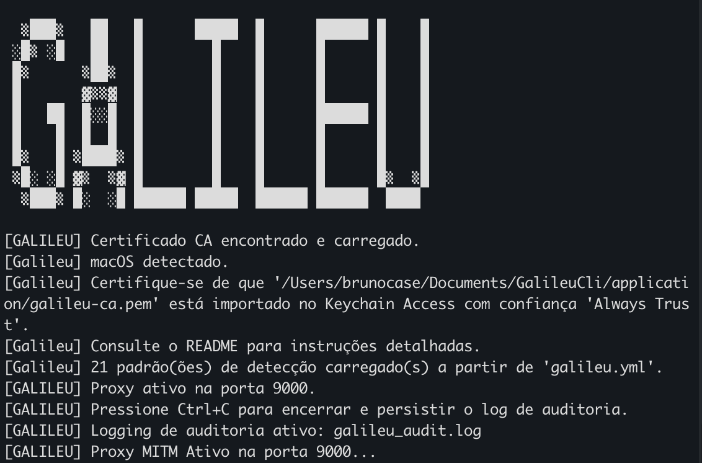
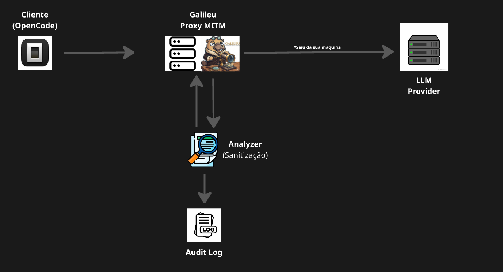
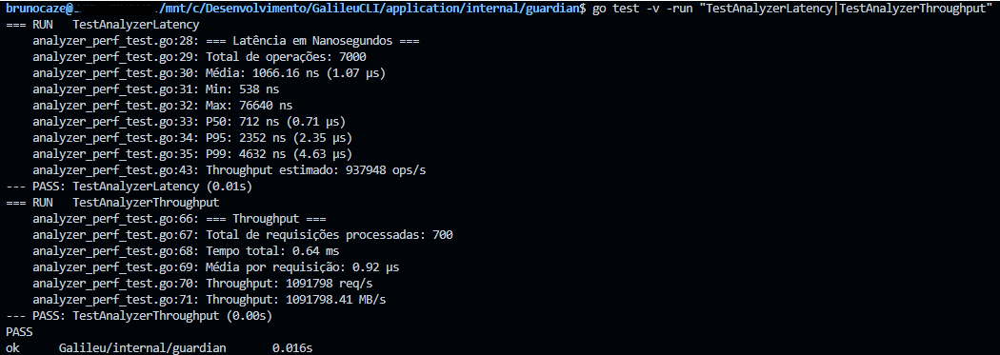
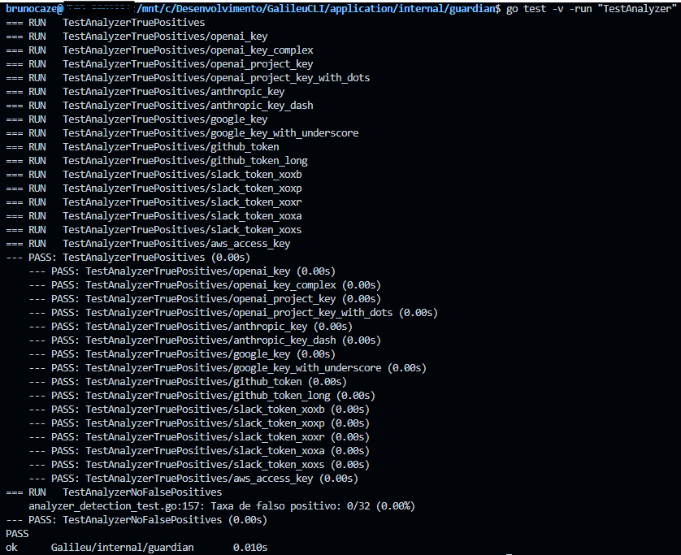
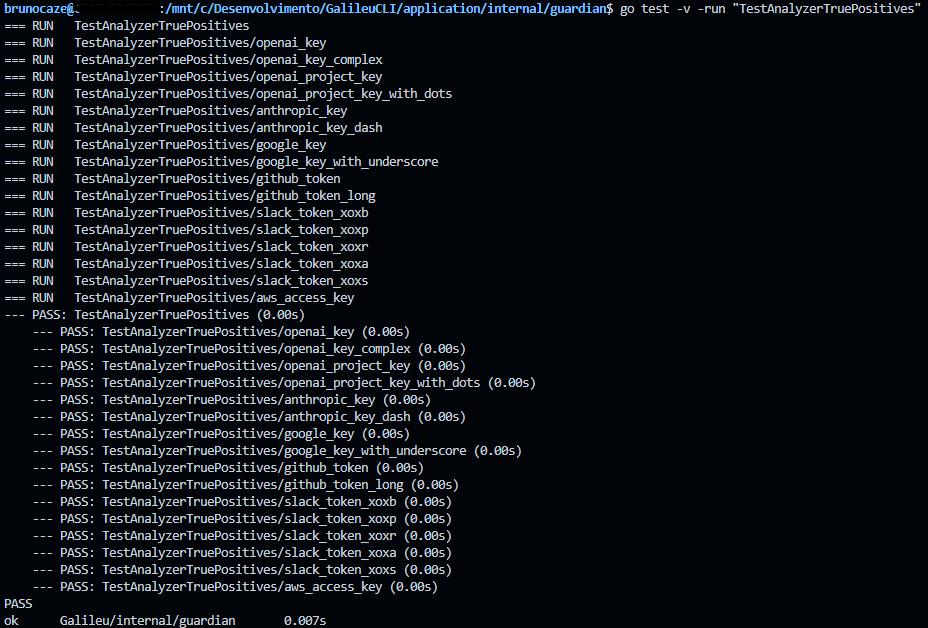
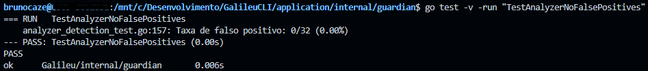
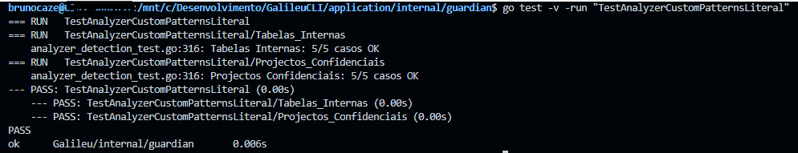
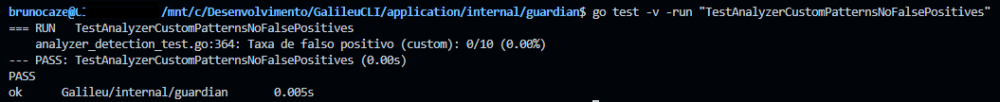

# Galileu — Proxy de Segurança e Governança para LLMs
> Suporta: macOS (Apple Silicon & Intel) · Windows · Linux

**Galileu** é uma ferramenta de segurança e governança de dados voltada para o monitoramento e sanitização de informações enviadas a provedores de Inteligência Artificial (LLMs). O projeto adota uma arquitetura de **Proxy Reverso MITM (Man-in-the-Middle)**, atuando como camada inteligente entre a sua ferramenta de desenvolvimento e os servidores das LLMs.

---

## Demonstração

### Funcionamento em Tempo Real



*O GIF acima mostra o OpenCode tentando ler dados sensíveis de ficheiros `.env` — o Galileu intercepta e sanitiza automaticamente as informações antes de chegarem à LLM.*

### Terminal em Execução



*Print do terminal durante a execução do Galileu, mostrando o proxy ativo e os registros de auditoria.*

---

## Arquitetura do Sistema



*Diagrama da arquitetura e funcioanmento do sistema 
---

## Compilação

### macOS — Apple Silicon (M1/M2/M3)
```bash
make build-mac-arm
```

### macOS — Intel
```bash
make build-mac-intel
```

### Windows
```bash
make build-windows
```

### Linux
```bash
make build-linux
```

Ou compilar para todas as plataformas de uma vez:
```bash
make build-all
```

---

## Configuração do Certificado CA

> **⚠️ PONTO CRÍTICO DE SEGURANÇA**
>
> O Galileu gera um Certificado de Autoridade (CA) **localmente na sua máquina**. Este certificado é exclusivo para o seu ambiente e **nunca deve sair do seu computador**.

### Como Funciona

```
┌─────────────────────────────────────────────────────────────┐
│                    SUA MÁQUINA LOCAL                        │
│                                                             │
│  ┌──────────┐    ┌──────────────────┐    ┌──────────┐       │   
│  │ Cliente  │───▶│  Galileu Proxy  │───▶│   LLM    │       │
│  │ (OpenCode)│◀───│  (localhost:9000)│◀───│ Provider│      │
│  └──────────┘    └──────────────────┘    └──────────┘       │
│                        │                                    │
│                        ▼                                    │
│              ┌──────────────────┐                           │
│              │   Certificado CA  │                          │
│              │  (Local apenas)   │                          │
│              │                   │                          │
│              │ galileu-ca.pem    │  ⚠️ NUNCA                │ 
│              │ galileu-ca-key.pem│  ⚠️ COMPARTILHAR         │
│              └──────────────────┘                           │
│                        │                                    │
│                        ▼                                    │
│              ┌──────────────────┐                           │
│              │  Keychain / Cert │                           │
│              │  Store do SO     │                           │
│              └──────────────────┘                           │
└─────────────────────────────────────────────────────────────┘
```

### O que acontece tecnicamente

1. O Galileu gera um par de chaves RSA 4096-bit **localmente** (`galileu-ca.pem` + `galileu-ca-key.pem`)
2. O certificado é instalado **apenas no seu sistema operacional** (Keychain no macOS, Cert Store no Windows, `/usr/local/share/ca-certificates/` no Linux)
3. Quando o proxy intercepta uma requisição HTTPS, ele apresenta um certificado assinado por esta CA
4. O seu SO confia no certificado porque a CA está instalada localmente
5. A chave privada (`galileu-ca-key.pem`) **nunca sai da sua máquina**

### Instalação por Sistema Operativo

#### macOS
O Galileu tentará instalar o certificado automaticamente no Keychain do sistema (será solicitada a senha de administrador na primeira execução). Caso prefira instalar manualmente:

```bash
sudo security add-trusted-cert -d -r trustRoot -k /Library/Keychains/System.keychain galileu-ca.pem
```

#### Windows
O Galileu instala automaticamente o certificado CA no repositório de certificados do sistema ao arrancar como **Administrador**. Basta executar `galileu.exe` com privilégios administrativos.

#### Linux
No Linux, a instalação é manual. Após compilar, execute:

```bash
sudo cp galileu-ca.pem /usr/local/share/ca-certificates/galileu.crt
sudo update-ca-certificates
```

### ⚠️ Proteção dos Ficheiros `.pem`

O seu `.gitignore` **já está configurado** para impedir o commit acidental:

```gitignore
# Certificados — nunca versionar
*.pem
galileu-ca-key.pem
galileu-ca.pem
```

**NUNCA** remova estas linhas do `.gitignore`. A chave privada (`galileu-ca-key.pem`) é o que permite ao Galileu fazer o MITM — se ela for exposta, um atacante pode criar certificados falsificados em seu nome.

---

## Execução

### macOS / Linux
```bash
./galileu
./scripts/start.sh
```

### Windows
```bash
galileu.exe
scripts\start.bat
```

> **Nota:** Certifique-se de que o OpenCode (ou outra ferramenta) está configurado para usar o proxy na porta **9000**.

---

## Pré-requisitos

| Requisito | Detalhe |
|---|---|
| **Sistema Operacional** | macOS (Apple Silicon & Intel), Windows 10/11, Linux (amd64) |
| **Go** | Versão 1.25 ou superior (necessário apenas para compilação) |
| **Privilégios** | macOS: `sudo` na primeira execução; Windows: Administrador |

---

## Estrutura de Ficheiros

```
Galileu/
├── galileu                  # Executável (macOS/Linux)
├── galileu.exe              # Executável (Windows)
├── galileu-ca.pem           # Certificado CA gerado automaticamente
├── galileu-ca-key.pem       # Chave privada do CA (⚠️ NÃO submeter para o repositório)
├── galileu.yml              # Configuração do analyzer (não versionado)
├── galileu.yml.example      # Exemplo de configuração (versionado)
├── Makefile                 # Compilação multiplataforma
├── scripts/
│   ├── start.sh             # Script shell para iniciar o OpenCode com proxy (macOS/Linux)
│   └── start.bat            # Script batch para iniciar o OpenCode com proxy (Windows)
├── cmd/
│   └── sentinel/
│       └── main.go          # Ponto de entrada
├── internal/
│   ├── ca/                  # Geração e gestão do certificado CA
│   └── guardian/           # Proxy MITM, Analyzer, Audit, instalação de certificado por plataforma
└── galileu_audit.log        # Registo de auditoria (gerado automaticamente)
```

---

## Hosts Monitorizados

O Galileu intercepta requisições para os seguintes provedores:

| Provedor | Host |
|---|---|
| OpenCode | `opencode.ai` |
| OpenAI | `api.openai.com` |
| Anthropic | `api.anthropic.com` |
| Google AI | `generativelanguage.googleapis.com` |
| Cohere | `api.cohere.ai` |
| Mistral | `api.mistral.ai` |

---

## Detecção de Dados Sensíveis

O **Analyzer** detecta e sanitiza automaticamente os seguintes padrões:

| Tipo | Padrão | Exemplo |
|---|---|---|
| OpenAI API Key | `sk-...` | `sk-1234567890abcdef...` |
| OpenAI Project Key | `sk-proj-...` | `sk-proj-abc123...` |
| Anthropic API Key | `sk-ant-...` | `sk-ant-abc123...` |
| Google API Key | `AIzaSy...` | `AIzaSyABC123...` |
| GitHub Token | `ghp_...` | `ghp_abcdef123456...` |
| Slack Token | `xox[baprs]-...` | `xoxb-123456...` |
| Discord Token | `xox[baprs]-...` | `xoxb-123456...` |
| AWS Access Key | `AKIA...` | `AKIAIOSFODNN7...` |
| AWS Secret Key | `wJalr...` | `wJalrXUtnFEM...` |

Todos os dados sensíveis detectados são substituídos por `[REDACTED_BY_GALILEU]`.

### Performance do Analyzer

O algoritmo de análise foi benchmarkado em hardware real com múltiplas metodologias:



#### Benchmark Puro (Go testing.B)

```
CPU: 13th Gen Intel(R) Core(TM) i5-13400
OS:  Linux (amd64)

BenchmarkAnalyze-16    	  405961	  2540 ns/op	  13568 B/op	  1 allocs/op
```

#### Teste de Latência (1000 iterações × 7 payloads)

```
=== Latência em Nanosegundos ===
Total de operações: 7000
Média: 1072.12 ns (1.07 µs)
Min: 542 ns
Max: 60242 ns
P50: 706 ns (0.71 µs)
P95: 2329 ns (2.33 µs)
P99: 5446 ns (5.45 µs)
Throughput estimado: ~932,729 ops/s
```

#### Teste de Throughput (100 iterações × 7 payloads)

```
=== Throughput ===
Total de requisições processadas: 700
Tempo total: 0.66 ms
Média por requisição: 0.94 µs
Throughput: 1,063,458 req/s
```

**Resultados Consolidados:**
| Métrica | Valor |
|--------|-------|
| Latência média | ~1.07 µs |
| Latência P95 | ~2.33 µs |
| Latência P99 | ~5.45 µs |
| Throughput | **>1 milhão req/s** |
| Memória | 13.5 KB/op |
| Alocações | 1 por operação |

O analyzer-processa **mais de 1 milhão de requisições por segundo** com latência inferior a 3µs no P95.

### Confiabilidade do Detector

O detector foi exaustivamente testado para garantir **0% de falsos positivos**:



#### Testes de True Positives (Detecção de API Keys)



Todos os 17 padrões suportados foram detectados corretamente:
- ✓ openai_key (2 casos)
- ✓ openai_project_key (2 casos)
- ✓ anthropic_key (2 casos)
- ✓ google_key (2 casos)
- ✓ github_token (2 casos)
- ✓ slack_token (6 casos)
- ✓ aws_access_key (1 caso)

#### ⚠️ Testes de Falsos Positivos (CRÍTICO)

Este é o teste **mais crítico** para garantir que requisições legítimas não sejam bloqueadas ou modificadas incorretamente:



**Resultado: 0/32 (0.00%)** - ZERO falsos positivos!

Casos testados que NÃO foram detectados:
- ✓ UUIDs (v4): não detectado
- ✓ MD5/SHA hashes: não detectado
- ✓ Base64 strings: não detectado
- ✓ Payloads normais (GPT, Claude, Gemini): não detectado
- ✓ Nomes de métodos Go: não detectado
- ✓ URLs e caminhos: não detectado
- ✓ Tokens de outros serviços: não detectado

Esta taxa de **0% de falsos positivos** é o diferencial que garante confiança no uso em produção.

**Resultados dos Testes:**
- **True Positives**: 17/17 detectados ✓
- **False Positives**: 0/32 (0.00%) ✓
- **Precisão**: 100%

Esta taxa de 0% de falsos positivos é crucial para garantir que requisições legítimas não sejam bloqueadas ou modificadas incorretamente.

---

## Registros de Auditoria Expandidos

O ficheiro `galileu_audit.log` será criado ao finalizar a primeira execução, e contém um registo JSON detalhado de cada requisição interceptada, incluindo:

- **Identificação**: Timestamp, Request ID, Session ID, Machine ID
- **Requisição**: Host, Provider, Path, Method, Modelo de LLM
- **Detecção**: Padrões detectados, contagem, posições de redacção
- **Payload**: Contagem de mensagens, presença de system prompt, streaming
- **Performance**: Latência do proxy, duração da análise
- **Resposta**: Status code, tamanhos de request/response

(Consulte a documentação no repositório para o schema completo dos campos de auditoria.)

---

## Configuração (galileu.yml)

O Galileu suporta configuração via ficheiro `galileu.yml` para personalizar os padrões de detecção sem recompilar o código.

### Estrutura do Ficheiro

O ficheiro `galileu.yml` deve seguir exatamente esta estrutura:

```yaml
port: 9000
analyzer:

  # ─── Padrões embutidos ─────────────────────────────────────────────────
  built_in:
    openai_key:         true
    openai_project_key: true
    anthropic_key:      true
    google_key:         true
    github_token:       true
    slack_token:        true
    discord_token:      true
    aws_key:            true

  # ─── Padrões personalizados ──────────────────────────────────────────────
  # Para ativar, mude enabled: false para enabled: true
  custom_patterns:
    # ...
```

### Campos Obrigatórios

| Campo | Tipo | Descrição |
|-------|------|------------|
| `port`     | object | Raiz da configuração |
| `analyzer` | object | Raiz da configuração |
| `built_in` | object | Contém os padrões embutidos |
| `custom_patterns` | array | Lista de padrões personalizados |


### Porta de execução
```yaml
 port: 9000
```
Você pode escolher a porta de execução da aplicação. Que por default é 9000.

> **Nota:** Lembre-se de mudar o apontamento da sua ferramenta para a porta definida.


### Padrões Built-in

Todos os padrões embutidos podem ser ativados ou desativados individualmente:

```yaml
analyzer:
  built_in:
    openai_key:         true
    openai_project_key: true
    anthropic_key:      true
    google_key:         true
    github_token:       true
    slack_token:        true
    discord_token:      true
    aws_key:            true
```

### Padrões Customizados

Adicione os seus próprios padrões de dois tipos:

**Regex** — para padrões complexos (use aspas normais `'...'`):
```yaml
custom_patterns:
  - name: "JWT Token"
    type: regex
    pattern: 'eyJ[a-zA-Z0-9_-]+\.eyJ[a-zA-Z0-9_-]+\.[a-zA-Z0-9_-]+'
    label: "[JWT_REDACTED]"
    enabled: true
```

**Literal** — para strings exatas:
```yaml
custom_patterns:
  - name: "Projectos Confidenciais"
    type: literal
    values:
      - "Operação Phoenix"
      - "Projecto Stargate"
    label: "[CONFIDENTIAL_PROJECT_REDACTED]"
    enabled: true
```

### Exemplos Completos

**Exemplo com padrão Regex:**
```yaml
- name: "Password de Base de Dados"
  type: regex
  pattern: 'DB_PASSWORD\s*=\s*[\x27]?[^\s\x27]+'
  label: "[DB_PASSWORD_REDACTED]"
  enabled: true
```

**Exemplo com padrão Literal:**
```yaml
- name: "Tabelas Internas"
  type: literal
  values:
    - "clientes_vip"
    - "transacoes_internas"
    - "dados_financeiros_2024"
  label: "[INTERNAL_TABLE_REDACTED]"
  enabled: true
```

### Notas Importantes

1. **Formato YAML**: Use espaços (não tabs) para indentação
2. **Aspas em Regex**: Use aspas normais `'...'` para definir patterns regex
3. **Escape**: Caracteres especiais como `\x27` são usados para evitar conflitos com aspas
4. **Enabled**: Defina `enabled: true` para ativar, `enabled: false` para desativar
5. **Label**: O texto de substituição deve ser único e descritivo

> **Nota:** Se o ficheiro `galileu.yml` não existir, o Galileu usa todos os padrões builtin activados por omissão.
> Para um guia completo, consulte o ficheiro `galileu.yml.example` no repositório.

---

## Resolução de Problemas

### "Falha ao ler certificado CA"
Remova os ficheiros `galileu-ca.pem` e `galileu-ca-key.pem` e execute novamente. O certificado será regenerado automaticamente.

### Windows: "Privilégios de administrador necessários"
Execute o `galileu.exe` como Administrador (clique direito → "Executar como administrador").

### Linux: Erro de certificado SSL/TLS
Certifique-se de que instalou o certificado conforme as instruções na secção "Configuração do Certificado CA".

---

## Testes

Pode verificar personalmente a confiabilidade e performance do analyzer executando os testes:

### Testes Built-in (Padrões do Código)

```bash
# Todos os testes do analyzer
go test -v -run "TestAnalyzer" ./internal/guardian/...

# True positives (built-in)
go test -v -run "TestAnalyzerTruePositives" ./internal/guardian/...

# False positives (built-in)
go test -v -run "TestAnalyzerNoFalsePositives" ./internal/guardian/...
```

### Testes de Padrões Customizados (galileu.yml)

Estes testes validam os padrões configuráveis via `galileu.yml`:

```bash
# Padrões customizados tipo regex
go test -v -run "TestAnalyzerCustomPatternsRegex" ./internal/guardian/...

# Padrões customizados tipo literal
go test -v -run "TestAnalyzerCustomPatternsLiteral" ./internal/guardian/...

# False positives (customizados)
go test -v -run "TestAnalyzerCustomPatternsNoFalsePositives" ./internal/guardian/...
```

#### Resultados dos Testes Customizados





**Regex Customizado:**
- DB_PASSWORD: 5/5 ✓
- Connection String: 5/5 ✓
- JWT: 1/1 ✓
- Private Key: 5/5 ✓
- False Positives: 0/10 (0.00%) ✓

**Literal Customizado:**
- Tabelas Internas: 5/5 ✓
- Projetos Confidenciais: 5/5 ✓

### Benchmarks e Performance

```bash
# Benchmarks
go test -bench=. -benchmem ./internal/guardian/...

# Testes de performance
go test -v -run "TestAnalyzerLatency|TestAnalyzerThroughput" ./internal/guardian/...
```

Ou consulte o ficheiro [markdown/tests.md](markdown/tests.md) para referência completa.

---

## Segurança

- A chave privada (`galileu-ca-key.pem`) é gerada localmente e **nunca** sai da sua máquina.
- **Nunca** efetue commit dos ficheiros `.pem` para o repositório — confirme que o `.gitignore` está atualizado.
- O certificado CA é válido por **10 anos** e utiliza chave **RSA 4096-bit**.
- O proxy atua exclusivamente sobre as ferramentas que configurarem explicitamente a porta **9000**.

---

## Licença

Este projeto está licenciado sob a **Apache License, Version 2.0**.

Copyright © 2026 **Bruno Dantas de Oliveira Casé**

Ver ficheiro [LICENSE](LICENSE) para mais detalhes.
