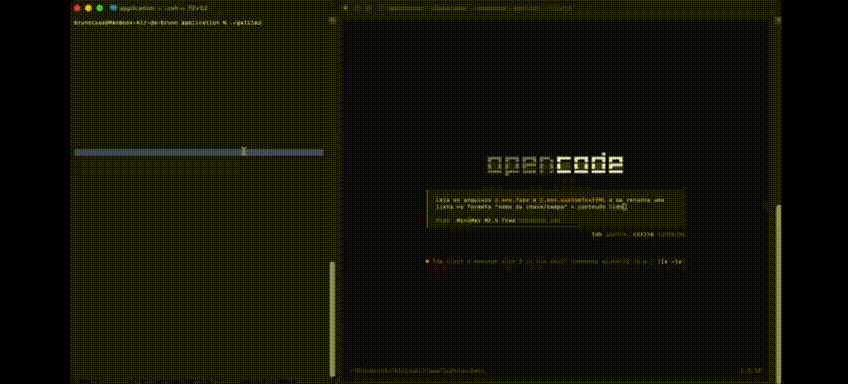

# Galileu — Proxy de Segurança e Governança para LLMs


> Suporta: macOS (Apple Silicon & Intel) · Windows · Linux

**Galileu** é uma ferramenta de segurança e governança de dados voltada para o monitoramento e sanitização de informações enviadas a provedores de Inteligência Artificial (LLMs). O projeto adota uma arquitetura de **Proxy Reverso MITM (Man-in-the-Middle)**, atuando como camada inteligente entre a sua ferramenta de desenvolvimento e os servidores das LLMs.

Ferramentas de AI coding como OpenCode, Cursor e GitHub Copilot leem arquivos do projeto inteiro — incluindo `.env`, configs e credenciais — e enviam tudo como contexto para a LLM. O Galileu intercepta essas requisições e redige automaticamente qualquer dado sensível antes que ele saia da sua máquina.

---

## Demonstração

### Funcionamento em Tempo Real

<p align="center">
  
</p>

*O GIF acima mostra o OpenCode tentando ler dados sensíveis de ficheiros `.env` — o Galileu intercepta e sanitiza automaticamente as informações antes de chegarem à LLM.*

### Terminal em Execução


*Print do terminal durante a execução do Galileu, mostrando o proxy ativo e os registros de auditoria.*

---

## Arquitetura do Sistema


*Diagrama da arquitetura e funcionamento do sistema.*

---

## Instalação Rápida

Baixe o binário pré-compilado para a sua plataforma em
[Releases](https://github.com/eubrunocase/GalileuCLI/releases/latest):

| Plataforma | Arquivo |
|---|---|
| macOS Apple Silicon (M1/M2/M3) | `galileu-darwin-arm64` |
| macOS Intel | `galileu-darwin-amd64` |
| Linux x86_64 | `galileu-linux-amd64` |
| Windows x86_64 | `galileu-windows-amd64.exe` |

**macOS / Linux:**
```bash
chmod +x galileu-darwin-arm64
./galileu-darwin-arm64
```

**Windows:**

Execute `galileu-windows-amd64.exe` como Administrador (clique direito → "Executar como administrador").

> Não é necessário ter Go instalado. A compilação é necessária apenas para desenvolvimento.

### Configuração Opcional

O binário funciona de forma autônoma. O arquivo `galileu.yml` é **opcional** — se não existir, todos os padrões built-in são ativados automaticamente.

O Galileu procura o `galileu.yml` no diretório onde o binário é executado, não dentro do próprio binário.

```
pasta-do-usuario/
├── galileu-darwin-arm64   ← binário baixado
└── galileu.yml            ← arquivo opcional (criado pelo usuário)
```

Para personalizar, crie um `galileu.yml` na mesma pasta do binário usando o `galileu.yml.example` como referência.

---

## Compilação

### macOS — Apple Silicon (M1/M2/M3)
```bash
make build-mac-arm
```

### macOS — Intel
```bash
make build-mac-intel
```

### Windows
```bash
make build-windows
```

### Linux
```bash
make build-linux
```

Ou compilar para todas as plataformas de uma vez:
```bash
make build-all
```

---

## Configuração do Certificado CA

> **⚠️ PONTO CRÍTICO DE SEGURANÇA**
>
> O Galileu gera um Certificado de Autoridade (CA) **localmente na sua máquina**. Este certificado é exclusivo para o seu ambiente e **nunca deve sair do seu computador**.

### Como Funciona

```
┌─────────────────────────────────────────────────────────────┐
│                    SUA MÁQUINA LOCAL                        │
│                                                             │
│  ┌──────────┐    ┌──────────────────┐    ┌──────────┐       │
│  │ Cliente  │───▶│  Galileu Proxy  │───▶│   LLM    │       │
│  │ (OpenCode)│◀───│  (localhost:9000)│◀───│ Provider│       │
│  └──────────┘    └──────────────────┘    └──────────┘       │
│                        │                                    │
│                        ▼                                    │
│              ┌──────────────────┐                           │
│              │   Certificado CA  │                          │
│              │  (Local apenas)   │                          │
│              │                   │                          │
│              │ galileu-ca.pem    │  ⚠️ NUNCA                │
│              │ galileu-ca-key.pem│  ⚠️ COMPARTILHAR         │
│              └──────────────────┘                           │
│                        │                                    │
│                        ▼                                    │
│              ┌──────────────────┐                           │
│              │  Keychain / Cert │                           │
│              │  Store do SO     │                           │
│              └──────────────────┘                           │
└─────────────────────────────────────────────────────────────┘
```

### O que acontece tecnicamente

1. O Galileu gera um par de chaves RSA 4096-bit **localmente** (`galileu-ca.pem` + `galileu-ca-key.pem`)
2. O certificado é instalado **apenas no seu sistema operacional** (Keychain no macOS, Cert Store no Windows, `/usr/local/share/ca-certificates/` no Linux)
3. Quando o proxy intercepta uma requisição HTTPS, ele apresenta um certificado assinado por esta CA
4. O seu SO confia no certificado porque a CA está instalada localmente
5. A chave privada (`galileu-ca-key.pem`) **nunca sai da sua máquina**

### Instalação por Sistema Operacional

#### macOS
O Galileu tentará instalar o certificado automaticamente no Keychain do sistema (será solicitada a senha de administrador na primeira execução). Caso prefira instalar manualmente:

```bash
sudo security add-trusted-cert -d -r trustRoot \
  -k /Library/Keychains/System.keychain galileu-ca.pem
```

#### Windows
O Galileu instala automaticamente o certificado CA no repositório de certificados do sistema ao executar como **Administrador**. Basta executar `galileu.exe` com privilégios administrativos.

#### Linux
No Linux, a instalação é manual. Após compilar, execute:

```bash
sudo cp galileu-ca.pem /usr/local/share/ca-certificates/galileu.crt
sudo update-ca-certificates
```

### ⚠️ Proteção dos Ficheiros `.pem`

O seu `.gitignore` **já está configurado** para impedir o commit acidental:

```gitignore
# Certificados — nunca versionar
*.pem
galileu-ca-key.pem
galileu-ca.pem
```

**NUNCA** remova estas linhas do `.gitignore`. A chave privada (`galileu-ca-key.pem`) é o que permite ao Galileu fazer o MITM — se ela for exposta, um atacante pode criar certificados falsificados em seu nome.

---

## Execução

### macOS / Linux
```bash
./galileu-darwin-arm64   # ou o binário da sua plataforma
./scripts/start.sh
```

### Windows
```bash
galileu-windows-amd64.exe
scripts\start.bat
```

> **Nota:** Certifique-se de que o OpenCode (ou outra ferramenta) está configurado para usar o proxy na porta **9000**.

---

## Pré-requisitos

### Para Utilizar (Binário)

| Requisito | Detalhe |
|---|---|
| **Sistema Operacional** | macOS (Apple Silicon & Intel), Windows 10/11, Linux (amd64) |
| **Privilégios** | macOS: `sudo` na primeira execução; Windows: Administrador |

> Não é necessário ter Go instalado.

### Para Desenvolver ou Compilar

| Requisito | Detalhe |
|---|---|
| **Sistema Operacional** | macOS (Apple Silicon & Intel), Windows 10/11, Linux (amd64) |
| **Go** | Versão 1.25 ou superior |
| **Privilégios** | macOS: `sudo` na primeira execução; Windows: Administrador |

---

## Estrutura de Ficheiros

```
Galileu/
├── galileu                  # Executável (macOS/Linux)
├── galileu.exe              # Executável (Windows)
├── galileu-ca.pem           # Certificado CA gerado automaticamente
├── galileu-ca-key.pem       # Chave privada do CA (⚠️ NÃO submeter para o repositório)
├── galileu.yml              # Configuração do analyzer (não versionado)
├── galileu.yml.example      # Exemplo de configuração (versionado)
├── Makefile                 # Compilação multiplataforma
├── scripts/
│   ├── start.sh             # Script shell para iniciar o OpenCode com proxy (macOS/Linux)
│   └── start.bat            # Script batch para iniciar o OpenCode com proxy (Windows)
├── cmd/
│   └── sentinel/
│       └── main.go          # Ponto de entrada
├── internal/
│   ├── ca/                  # Geração e gestão do certificado CA
│   └── guardian/            # Proxy MITM, Analyzer, Audit, instalação de certificado por plataforma
└── galileu_audit.log        # Registo de auditoria (gerado automaticamente na primeira execução)
```

---

## Hosts Monitorizados

O Galileu intercepta requisições para os seguintes provedores:

| Provedor | Host |
|---|---|
| OpenCode | `opencode.ai` |
| OpenAI | `api.openai.com` |
| Anthropic | `api.anthropic.com` |
| Google AI | `generativelanguage.googleapis.com` |
| Cohere | `api.cohere.ai` |
| Mistral | `api.mistral.ai` |

---

## Detecção de Dados Sensíveis

O **Analyzer** detecta e sanitiza automaticamente os seguintes padrões:

| Tipo | Padrão | Exemplo |
|---|---|---|
| OpenAI API Key | `sk-...` | `sk-1234567890abcdef...` |
| OpenAI Project Key | `sk-proj-...` | `sk-proj-abc123...` |
| Anthropic API Key | `sk-ant-...` | `sk-ant-abc123...` |
| Google API Key | `AIzaSy...` | `AIzaSyABC123...` |
| GitHub Token | `ghp_...` | `ghp_abcdef123456...` |
| Slack Token | `xox[baprs]-...` | `xoxb-123456...` |
| Discord Token | `xox[baprs]-...` | `xoxb-123456...` |
| AWS Access Key | `AKIA...` | `AKIAIOSFODNN7...` |
| AWS Secret Key | `wJalr...` | `wJalrXUtnFEM...` |

Todos os dados sensíveis detectados são substituídos por `[REDACTED_BY_GALILEU]`.

### Performance do Analyzer

O algoritmo de análise foi benchmarkado em hardware real com múltiplas metodologias:


#### Benchmark Puro (Go testing.B)

```
CPU: 13th Gen Intel(R) Core(TM) i5-13400
OS:  Linux (amd64)

BenchmarkAnalyze-16      405961      2540 ns/op      13568 B/op      1 allocs/op
```

#### Teste de Latência (1000 iterações × 7 payloads)

```
=== Latência em Nanosegundos ===
Total de operações: 7000
Média: 1072.12 ns (1.07 µs)
Min: 542 ns
Max: 60242 ns
P50: 706 ns  (0.71 µs)
P95: 2329 ns (2.33 µs)
P99: 5446 ns (5.45 µs)
Throughput estimado: ~932,729 ops/s
```

#### Teste de Throughput (100 iterações × 7 payloads)

```
=== Throughput ===
Total de requisições processadas: 700
Tempo total: 0.66 ms
Média por requisição: 0.94 µs
Throughput: 1,063,458 req/s
```

**Resultados Consolidados:**

| Métrica | Valor |
|---|---|
| Latência média | ~1.07 µs |
| Latência P95 | ~2.33 µs |
| Latência P99 | ~5.45 µs |
| Throughput | **>1 milhão req/s** |
| Memória | 13.5 KB/op |
| Alocações | 1 por operação |

> **Nota Metodológica:** O benchmark primário é o teste `testing.B` do Go (405.961 iterações), o padrão mais rigoroso da linguagem. Os valores de throughput são baseados em amostras menores (700 operações) e servem como referência complementar.

### Confiabilidade do Detector

O detector foi exaustivamente testado para garantir **0% de falsos positivos**:


#### Testes de True Positives


Todos os 17 padrões suportados foram detectados corretamente:

- ✓ openai_key (2 casos)
- ✓ openai_project_key (2 casos)
- ✓ anthropic_key (2 casos)
- ✓ google_key (2 casos)
- ✓ github_token (2 casos)
- ✓ slack_token (6 casos)
- ✓ aws_access_key (1 caso)

#### ⚠️ Testes de Falsos Positivos (CRÍTICO)


**Resultado: 0/32 (0.00%)** — ZERO falsos positivos.

Casos testados que NÃO foram detectados:
- ✓ UUIDs (v4)
- ✓ MD5/SHA hashes
- ✓ Base64 strings
- ✓ Payloads normais (GPT, Claude, Gemini)
- ✓ Nomes de métodos Go
- ✓ URLs e caminhos
- ✓ Tokens de outros serviços

**Resultados dos Testes:**

| Métrica | Resultado |
|---|---|
| True Positives | 17/17 ✓ |
| False Positives | 0/32 (0.00%) ✓ |
| Precisão | 100% |

---

## Registros de Auditoria

O ficheiro `galileu_audit.log` é criado automaticamente ao finalizar a primeira execução e contém um registro JSON detalhado de cada requisição interceptada:

- **Identificação**: Timestamp, Request ID, Session ID, Machine ID
- **Requisição**: Host, Provider, Path, Method, Modelo de LLM
- **Detecção**: Padrões detectados, contagem, posições de redação
- **Payload**: Contagem de mensagens, presença de system prompt, streaming
- **Performance**: Latência do proxy, duração da análise
- **Resposta**: Status code, tamanhos de request/response

Consulte o ficheiro [markdown/SCHEMA_AUDITORIA.md](markdown/SCHEMA_AUDITORIA.md) para o schema completo dos campos de auditoria.

---

## Configuração (galileu.yml)

O ficheiro `galileu.yml` é **opcional** e deve ser colocado no diretório onde o binário é executado. Se não existir, todos os padrões built-in são ativados automaticamente.

### Estrutura do Ficheiro

```yaml
port: 9000

analyzer:

  # ─── Padrões embutidos ──────────────────────────────────────
  built_in:
    openai_key:         true
    openai_project_key: true
    anthropic_key:      true
    google_key:         true
    github_token:       true
    slack_token:        true
    discord_token:      true
    aws_key:            true

  # ─── Padrões personalizados ─────────────────────────────────
  # Para ativar, mude enabled: false para enabled: true
  custom_patterns:
    # ...
```

### Campos Obrigatórios

| Campo | Tipo | Descrição |
|---|---|---|
| `port` | integer | Porta de execução do proxy (padrão: 9000) |
| `analyzer` | object | Raiz da configuração do analyzer |
| `built_in` | object | Padrões embutidos e seus estados |
| `custom_patterns` | array | Lista de padrões personalizados |

### Porta de Execução

```yaml
port: 9000
```

Você pode escolher qualquer porta disponível. O padrão é `9000`.

> **Nota:** Lembre-se de apontar a sua ferramenta de IA para a mesma porta definida aqui.

### Padrões Customizados

**Regex** — para padrões complexos:
```yaml
custom_patterns:
  - name: "JWT Token"
    type: regex
    pattern: 'eyJ[a-zA-Z0-9_-]+\.eyJ[a-zA-Z0-9_-]+\.[a-zA-Z0-9_-]+'
    label: "[JWT_REDACTED]"
    enabled: true
```

**Literal** — para strings exatas:
```yaml
custom_patterns:
  - name: "Projetos Confidenciais"
    type: literal
    values:
      - "Operação Phoenix"
      - "Projeto Stargate"
    label: "[CONFIDENTIAL_PROJECT_REDACTED]"
    enabled: true
```

#### Resultados dos Testes Customizados


**Regex Customizado:**
- DB_PASSWORD: 5/5 ✓
- Connection String: 5/5 ✓
- JWT: 1/1 ✓
- Private Key: 5/5 ✓
- False Positives: 0/10 (0.00%) ✓

**Literal Customizado:**
- Tabelas Internas: 5/5 ✓
- Projetos Confidenciais: 5/5 ✓

### Notas Importantes

1. **Formato YAML**: Use espaços (não tabs) para indentação
2. **Aspas em Regex**: Use aspas simples `'...'` para patterns regex
3. **Escape**: Use `\x27` para evitar conflitos com aspas em patterns
4. **Enabled**: `enabled: true` para ativar, `enabled: false` para desativar
5. **Label**: O texto de substituição deve ser único e descritivo

---

## Testes

Verifique pessoalmente a confiabilidade e performance do analyzer:

### Testes Built-in

```bash
# Todos os testes do analyzer
go test -v -run "TestAnalyzer" ./internal/guardian/...

# True positives
go test -v -run "TestAnalyzerTruePositives" ./internal/guardian/...

# False positives
go test -v -run "TestAnalyzerNoFalsePositives" ./internal/guardian/...
```

### Testes de Padrões Customizados

```bash
# Regex customizado
go test -v -run "TestAnalyzerCustomPatternsRegex" ./internal/guardian/...

# Literal customizado
go test -v -run "TestAnalyzerCustomPatternsLiteral" ./internal/guardian/...

# False positives customizados
go test -v -run "TestAnalyzerCustomPatternsNoFalsePositives" ./internal/guardian/...
```

### Benchmarks e Performance

```bash
go test -bench=. -benchmem ./internal/guardian/...
go test -v -run "TestAnalyzerLatency|TestAnalyzerThroughput" ./internal/guardian/...
```
Consulte o ficheiro [markdown/tests.md](markdown/tests.md) para mais informações sobre a execução dos testes

---

## Resolução de Problemas

**"Falha ao ler certificado CA"**
Remova os ficheiros `galileu-ca.pem` e `galileu-ca-key.pem` e execute novamente. O certificado será regenerado automaticamente.

**Windows: "Privilégios de administrador necessários"**
Execute o `galileu.exe` como Administrador (clique direito → "Executar como administrador").

**Linux: Erro de certificado SSL/TLS**
Certifique-se de que instalou o certificado conforme as instruções na secção "Configuração do Certificado CA".

---

## Segurança

- A chave privada (`galileu-ca-key.pem`) é gerada localmente e **nunca** sai da sua máquina
- **Nunca** efetue commit dos ficheiros `.pem` para o repositório
- O certificado CA é válido por **10 anos** com chave **RSA 4096-bit**
- O proxy atua exclusivamente sobre as ferramentas que configurarem a porta definida

Consulte o ficheiro [SECURITY.md](SECURITY.md) para obter informações acerca do reporte de vulnerabilidades.

---

## Roadmap

| Ordem | Feature | Descrição |
|---|---|---|
| 1 | **Integração com Gemini CLI + Claude Code** | Suporte nativo para interceptação e governança de tráfego |
| 2 | **Integração com GitHub Copilot (VSCode)** | Sanitização de requisições dentro do Visual Studio Code |
| 3 | **TUI (Terminal User Interface)** | Interface interativa para configuração e monitorização em tempo real |
| 4 | **Instalação via Homebrew** | `brew install galileu` |

---

## Licença

Este projeto está licenciado sob a **Apache License, Version 2.0**.

Copyright © 2026 **Bruno Dantas de Oliveira Casé**

Ver ficheiro [LICENSE](LICENSE) para mais detalhes.